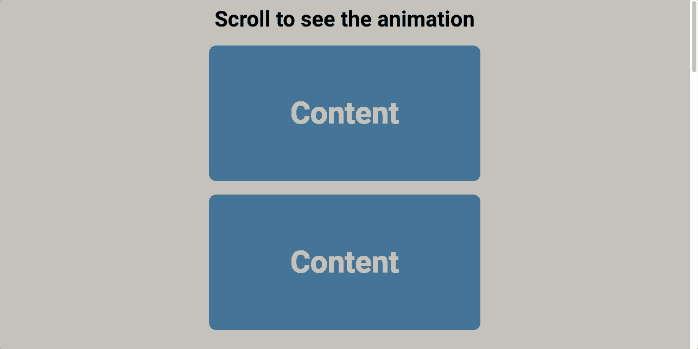

## Project Title

Scroll Animation

## Purpose

As a new developer, I want to do a daily coding project tutorial to learn new features and deepen my understanding of Web Development.

## Description

Simple, but useful feature that uses CSS & JavaScript to slide in sections, images, etc., to the viewport from the left and right as the user scrolls down the page.

## Demo

## Contributors

Brad Traversy. Florin Pop.
